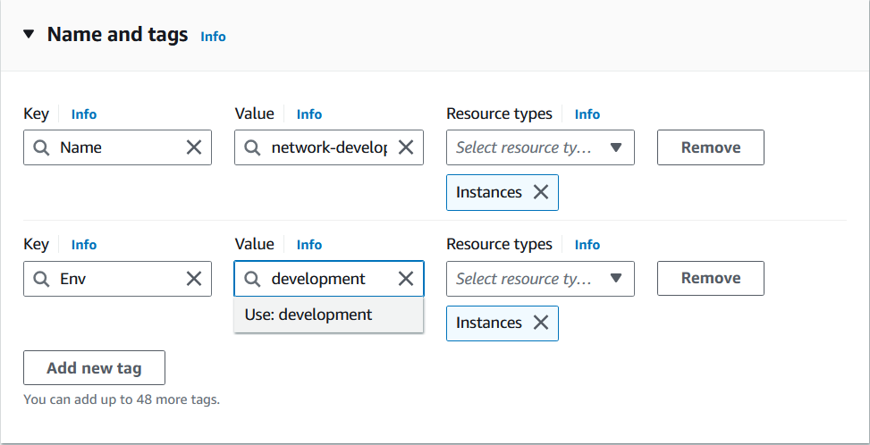
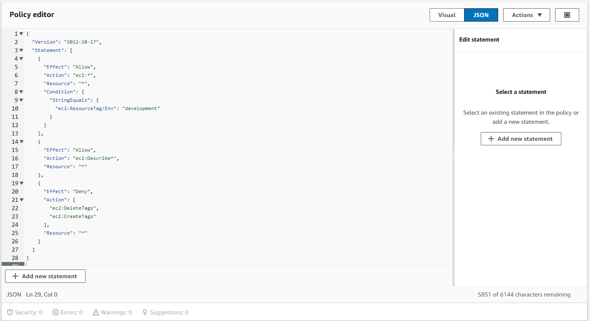
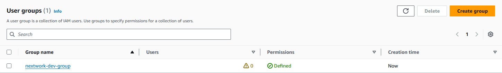
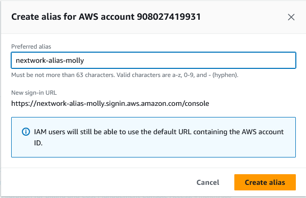
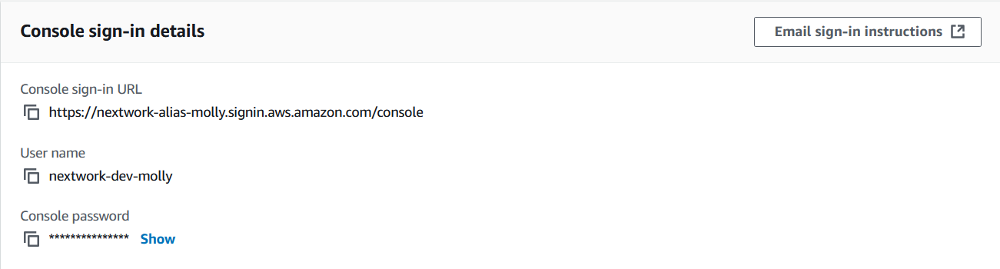
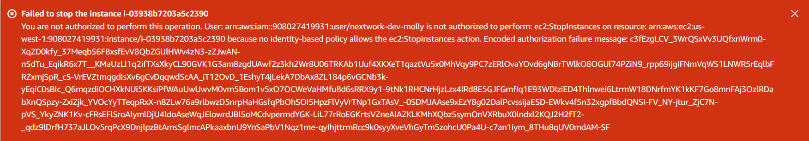
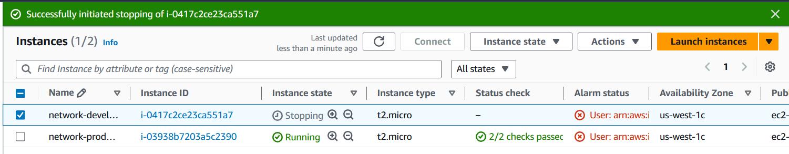

# AWS-Cloud-Security
AWS Cloud Security Project utilizing IAM.

# Overview
This project involves using AWS Identity and Access Management (IAM) to enhance cloud security by managing access to AWS resources effectively. The focus is on using IAM policies to control permissions based on environment-specific tags, providing secure and restricted access to different AWS resources.

# Project Goals
* Implement **AWS IAM Policies**: Create IAM policies to manage user access to EC2 instances based on their environment (e.g., development or production).
* Use **Tags** for Resource Management: Apply tags to EC2 instances to categorize resources and control access based on these tags.
* **Test** and **Troubleshoot** Policies: Verify the effectiveness of policies by attempting actions that should be allowed or denied, such as stopping instances.

# What is AWS IAM?
AWS IAM (Identity and Access Management) lets you securely manage access to AWS services by controlling user permissions, ensuring only authorized users can access specific resources, enhancing overall security.

# Tags in AWS
Tags are labels that help AWS account users identify and organize their resources. They are useful for managing large groups of resources and enforcing security policies. In this project, tags like "Env" with values such as "production" or "development" were applied to categorize instances.

# Step-by-Step Implementation
## 1. Setting up Tags
I applied tags to the EC2 instances to help identify their environment. The tag "Env" was assigned with values such as "production" or "development", which allowed for easier management and implementation of security policies.

## 2. Creating IAM Policies
For this project, I used AWS IAM to create a JSON policy that controls access based on the environment tags of EC2 instances.
* Effect: Allow EC2 actions on instances tagged with "Env: development".
* Allow Describe Actions: Allow ec2:Describe* actions to provide read-only access to EC2 resources for informational purposes.
* Restricted Actions: Restrict creating or deleting tags on EC2 instances.

### JSON Policy Example

## Defining IAM Policy Attributes
When creating a JSON policy, you have to define its Effect, Action, and Resource:
* Effect: Specifies whether the policy allows or denies the action.
* Action: Defines the action(s) to be performed, such as starting or stopping an EC2 instance.
* Resource: Identifies the resource(s) to which the policy applies, like specific instances or buckets in your AWS account.

These attributes are crucial to ensure that only the necessary permissions are granted to users, minimizing potential security risks.

## 3. Assigning Policies to User Groups
IAM user groups are helpful for organizing and managing permissions for multiple users at once. I attached the policy to a user group, ensuring all members of the group inherited these permissions.

### IAM Users and User Groups
* Users: IAM users are individual logins or people with access to my AWS account, created using the AWS IAM service. Specific permissions can be assigned to these 
  users for accessing account resources and services.

* User Groups: IAM user groups act like folders that allow you to assign policies and permissions to multiple users at once. I attached the policy I created to a 
  user group, so any users added to that group automatically inherit the access permissions defined for the group.

### Account Alias
An account alias is a custom name assigned to an AWS account, replacing the Account ID in the login URL. It took me less than a minute to create an account alias, making the AWS console sign-in URL more recognizable and user-friendly.

For example:

Now, my new AWS console sign-in URL is:
https://nextwork-alias-molly.signin.aws.amazon.com/console

This makes logging in much more convenient compared to using the default account ID.

## 4. Logging in as an IAM User
To log in as an IAM user, AWS provides two methods: emailing the sign-in instructions or downloading a .csv file containing the login details. When I logged in as my IAM user, I noticed that many panels showed "Access denied" messages, which contrasted with the unrestricted access I usually have with my main AWS account. This emphasized the importance of correctly configuring permissions to ensure limited, secure access.

## 5. Testing IAM Policies
To validate the IAM policies, I tested both development and production instances by attempting the Stop Instances action.

### Stopping the Production Instance
When I attempted to stop the production instance, I received an error message stating that I was not authorized to perform this action. This confirmed that the policy was correctly denying actions on production-tagged resources.

### Stopping the Development Instance
When I tried to stop the development instance, the action succeeded. This is because the policy attached to the user group, which my user is assigned to, allowed all EC2 actions on instances with the "Env" tag set to "development".

# Troubleshooting and Lessons Learned
One unexpected challenge was encountering "Access denied" messages while logged in as an IAM user. This highlighted the differences in permissions between a regular user and an administrator account, emphasizing the importance of correctly configuring permissions for different roles.

# Summary
This project demonstrates the importance of precise access control in cloud environments using AWS IAM. By using tags and well-crafted policies, I was able to create a secure environment that grants access only where necessary. It was a valuable experience that reinforced best practices in cloud security.
